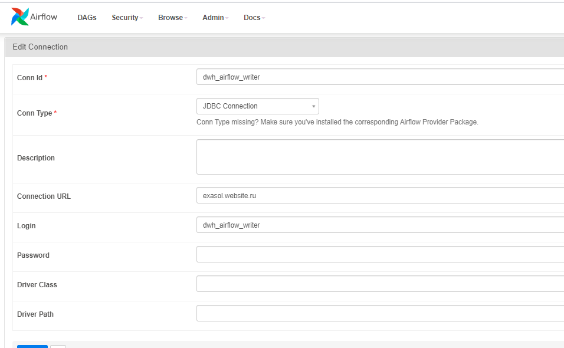
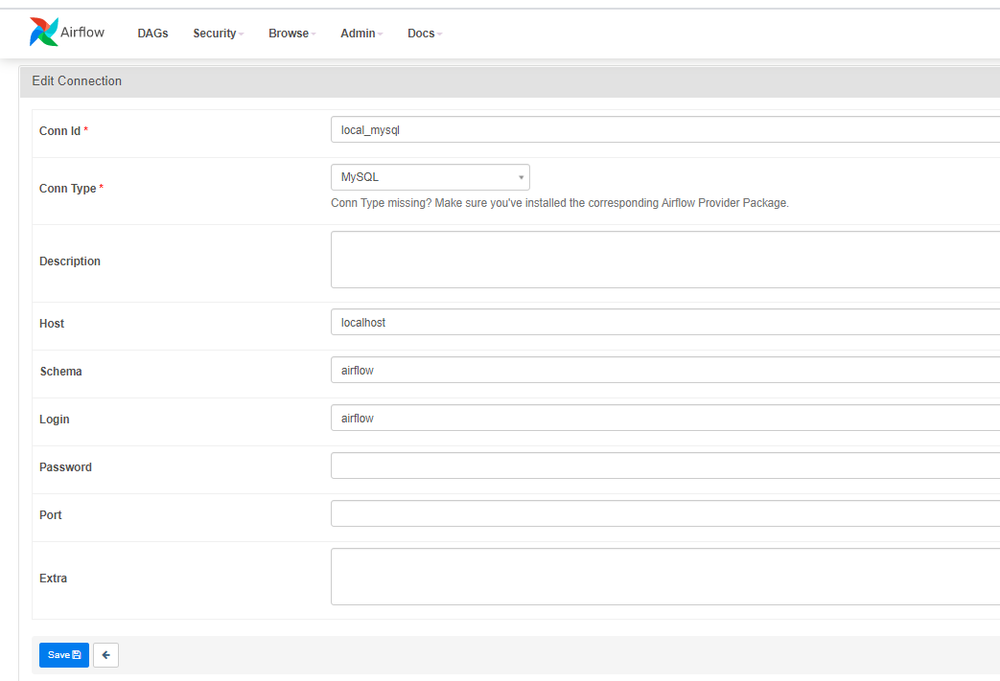

# exasol_replicator

## Настройка
Следующие параметры - это airflow conn id
```python
EXA_NAME = 'exasol'
MYSQL_NAME = 'mysql'
```
###Exasol

###Mysql


Репликация таблиц задается, через конфиг `jobs/Exasol/dag_exasol_replicator.conf`

```python
...
   {
    # Пример
    load_type: merge, # Тип загрузки merge или truncate
    source_schema: baza, # Из какой базы
    source_table_name: users, # Из какой таблицы забираем
    source_main_field: id, #Основное поле по которому будем убирать дубли
    source_merge_columns: {
      updated_at: datetime,
      created_at: datetime,
      id: int
    }, #поля по которым будем отбирать новые строки. Можно только datetime и int колонки
    target_schema: REPLICA, #Схема куда заливаем в exasol
    target_table_name: USERS, #Название таблицы
    target_main_field: ID, #Поле в exasol по которому будем убирать дубли
  },
  ...
```
Если тип `truncate` и заданы `source_merge_columns`, или при `merge` при пустой таблицы, данные заливаются частями, за это отвечает `try_full_insert_with_split_by_dt`
Эту часть нужно мзенить, сейчас там захардкодены колонки
```python
 if ("created_at" in list_dt_cols) | ("updated_at" in list_dt_cols) | ("EventTime" in list_dt_cols):
                if "created_at" in list_dt_cols:
                    data_filed = 'created_at'
                    freq = 'AS'
                    start_year = 2018
                elif "updated_at" in list_dt_cols:
                    data_filed = 'updated_at'
                    freq = 'AS'
                    start_year = 2018
                elif "EventTime" in list_dt_cols:
                    data_filed = 'EventTime'
                    freq = 'W-MON'
                    start_year = 2021
```